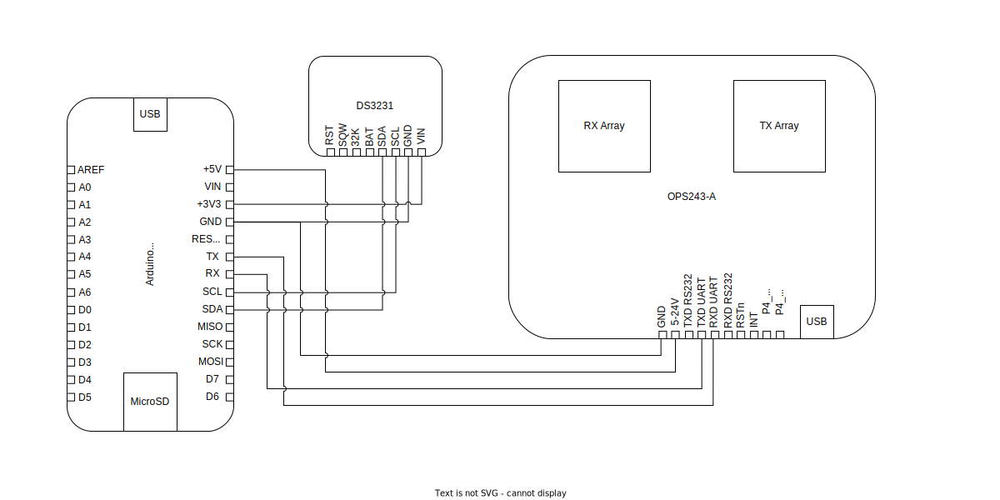

# traffic-radar
This project is a traffic speed and volume data-logger utilizing an [OmniPreSense OPS243-A](https://omnipresense.com/product/ops243-doppler-radar-sensor/) dopplar radar and an [Arduino MKR Zero](https://docs.arduino.cc/hardware/mkr-zero). Full schematics and source code coming soon. In the meantime, check out the BOM below. 

## System Schematic
The traffic radar system is powered through the Arduino. The Arduino is connected to the battery bank via a USB cable. The DS3231 real-time clock module is connected to the Arduino via four wires-- two for power and two for data. The RTC is powered using the 3.3V output from the Arduino, and the data lines are connected to the Arduino I2C pins (SDA connects to SDA and SCL connects to SCL). The OPS243 radar board is also connected to the arduino via four wires-- two for power and two for data. The radar board is connected via the 5V output from the Arduino, and the data lines are connected to the Arduino hardware serial pins (RX/TX). Make sure that the radar TX connects to the Arduino RX, and the radar RX connects to the Arduino TX.



## BOM
As a rough estimate, my total cost to build this system is about $350.
- [OmniPreSense OPS243-A](https://omnipresense.com/product/ops243-doppler-radar-sensor/) (make sure you get the non-wifi version, part number OPS243-A-CW-RP)
- [Arduino MKR Zero](https://docs.arduino.cc/hardware/mkr-zero)
- SD card formatted with a FAT32 partition no larger than 32GB
- DS3231-based real-time clock module (I use the [Adafruit DS3231](https://www.adafruit.com/product/3013). Note, the RTC module may not come with a battery, but you'll want one so that time is retained even when the system is disconnected)
- USB power bank (I use a [16 x 18650 Li-ion pack](https://www.amazon.com/dp/B09TZSSYRV) so that I can get long runtimes and also source my own high-quality cells)
- 18650 Li-ion cells (I bought 16x [Samsung 35E cells](https://www.18650batterystore.com/collections/18650-batteries/products/samsung-35e), but the battery pack listed above can be used with as few cells as you want)
- Waterproof enclosure
  - Based on the 18650 enclosure I bought, I purchased this [QILIPSU 8.6" x 6.7" x 4.3"](https://www.amazon.com/dp/B085QCT543) enclosure, which fits the battery pack perfectly. Note, you will need a [slim 90 degree USB adapter](https://www.amazon.com/dp/B0BVJXN99B) in order to get the battery pack to fit. There's enough extra room with this combination of enclosure + battery pack to be able to fit a second battery pack for double the runtime, since these packs support pass-through charging (you'd connect the output of the first to the input of the second, and the output of the second to the Arduino).
  - Depending on where you intend to install your traffic radar, you may want a [pole mounting kit](https://www.amazon.com/gp/product/B0B4DW4HFM) for the enclosure
- USB cable (from battery pack to Aruidno)
- Breadboard or perfboard, as well as wires or jumpers to hold and connect the Arduino with the RTC module and the radar board

## Arduino code
At the top of the [Arduino source code file](traffic-radar.ino) are several constants that can be modified to suit your particular installation and adjust how the radar system operates. The basic operation is this:
  1. The Arduino will read incoming serial data from the radar whenever a vehicle moves through its line-of-site.
  2. We keep track of the current maximum observed speed in both the inbound and outbound directions, but terminate a single vehicle capture and log a datapoint if we go a long enough time without a new speed datapoint or if the total capture time exceeds the threshold.
  3. If we go long enough without receiving radar data, we put the radar into a low-power state for a specified amount of time. Upon wakeup, we mandate that the radar stays awake and searching for a vehicle for a minimum amount of time before it's allowed to sleep again. This sleep/wakeup process is referred to as "hibernation", and is able to reduce total system power consumption and extend runtimes.
  4. Every 10 seconds, we flush the SD card buffer and write all logged datapoints. This ensures that when the system battery dies or is disconnected, we will lose at most the last 10 seconds of data.

With this in mind, here is how the following constants will control system operation:
- `hibernate` set to true to enable hiberation and put the radar in a low-power state occasionally to reduce system power consumption
- `lateDataTimeThreshold` this is how long to wait, in miliseconds, after the most recent radar data has been received before entering hibernation
- `sleepTime` this is how long the radar will spend in its low-power state before waking back up 

```
////////////////////////////////////////////////////////////////////////////
// modify these values to control behavior
////////////////////////////////////////////////////////////////////////////

// set to true to enable hibernation behavior
const boolean hibernate = true;
// if we haven't recieved a data packet in this many mS, we'll sleep
const int lastDataTimeThreshold = 1500;
// how long to sleep (keep in mind how long a vehicle will spend in view of
// your radar and set this value comfortably lower than this)
const int sleepTime = 750;
// at minimum, how long should the radar stay on after waking up from sleep
const int minOnTime = 1000;
//longest time a car could be in view of sensor before we record a datapoint
const int timeStartThreshold = 3500;
//log and reset if we haven't had a speed reading in this long
const int timeLastThreshold = 650;
```
