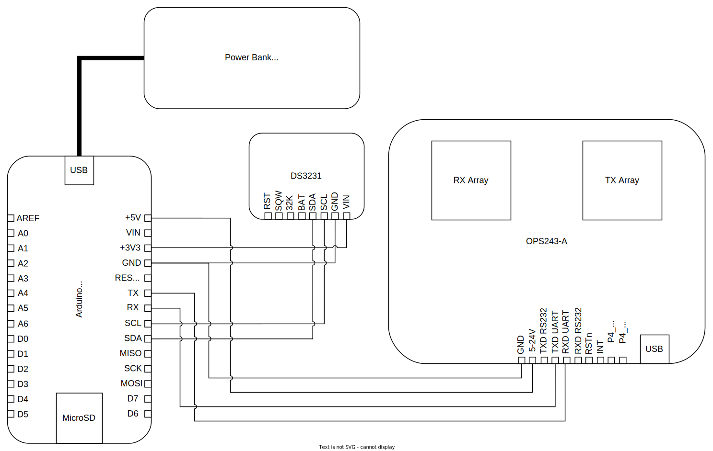

# traffic-radar
This project is a traffic speed and volume data-logger utilizing an [OmniPreSense OPS243-A](https://omnipresense.com/product/ops243-doppler-radar-sensor/) dopplar radar and an [Arduino MKR Zero](https://docs.arduino.cc/hardware/mkr-zero). Full schematics and source code coming soon. In the meantime, check out the BOM below. 

## System Schematic
The traffic radar system is powered through the Arduino. The Arduino is connected to the battery bank via a USB cable. The DS3231 real-time clock module is connected to the Arduino via four wires-- two for power and two for data. The RTC is powered using the 3.3V output from the Arduino, and the data lines are connected to the Arduino I2C pins (SDA/SCL). The OPS243 radar board is also connected to the arduino via four wires-- two for power and two for data. The radar board is connected via the 5V output from the Arduino, and the data lines are connected to the Arduino hardware serial pins (RX/TX). Makd sure that the radar TX connects to the Arduino RX, and the radar RX connects to the Arduino TX.

## BOM
As a rough estimate, my total cost to build this system is about $350.
- [OmniPreSense OPS243-A](https://omnipresense.com/product/ops243-doppler-radar-sensor/) (make sure you get the non-wifi version, part number OPS243-A-CW-RP)
- [Arduino MKR Zero](https://docs.arduino.cc/hardware/mkr-zero)
- SD card formatted with a FAT32 partition no larger than 32GB
- DS3231-based real-time clock module (I use the [Adafruit DS3231](https://www.adafruit.com/product/3013). Note, the RTC module may not come with a battery, but you'll want one so that time is retained even when the system is disconnected)
- USB power bank (I use a [16 x 18650 Li-ion pack](https://www.amazon.com/dp/B09TZSSYRV) so that I can get long runtimes and also source my own high-quality cells)
- 18650 Li-ion cells (I bought 16x [Samsung 35E cells](https://www.18650batterystore.com/collections/18650-batteries/products/samsung-35e), but the battery pack listed above can be used with as few cells as you want)
- Waterproof enclosure
  - Based on the 18650 enclosure I bought, I purchased this [QILIPSU 8.6" x 6.7" x 4.3"](https://www.amazon.com/dp/B085QCT543) enclosure, which fits the battery pack perfectly. Note, you will need a [slim 90 degree USB adapter](https://www.amazon.com/dp/B0BVJXN99B) in order to get the battery pack to fit. There's enough extra room with this combination of enclosure + battery pack to be able to fit a second battery pack for double the runtime, since these packs support pass-through charging (you'd connect the output of the first to the input of the second, and the output of the second to the Arduino).
  - Depending on where you intend to install your traffic radar, you may want a [pole mounting kit](https://www.amazon.com/gp/product/B0B4DW4HFM) for the enclosure
- USB cable (from battery pack to Aruidno)
- Breadboard or perfboard, as well as wires or jumpers to hold and connect the Arduino with the RTC module and the radar board
